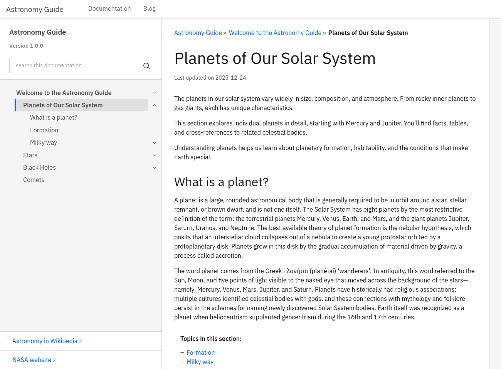

# sphinx_corpo_theme

A Sphinx theme with a modern corporate aesthetic, including templates for conventional documentation and blog posts. The design is inspired by the [IBM documentation](https://www.ibm.com/docs/en/zos/3.2.0) as of October 2025.



> [!NOTE]
> While this theme covers almost all essential functionality, it remains a work in progress and will continue to evolve.

## Theme options

The theme supports the following options to be used in the `html_theme_options` variable of your `conf.py`.

### template_overrides

Enables overriding the default template for all documents within a specified directory hierarchy. Unlike Sphinx’s `html_additional_pages`, which targets individual files, this option applies to directories.

```python
# uses 'blog.html' template for documents in 'blog' directory
'template_overrides' : {
    'blog/' : 'blog.html',
}
```

### show_menu_bar

Show the menu bar at the top of each page. This bar is costumizable and have the company logo, website name and a menu. The default value is `False`.

### menu_bar_items

List of entries to be show in the menu bar. Each entry is a `dict` with the following fields:

* `title`: text to label the menu entry;
* `docname`: optional reference to a document in the TOC tree;
* `url`: optional URL.

If `docname` is specified, the theme will use the relative path to that document. Otherwise, the `url` will be used.

```python
'menu_bar_items': [
    {'title': 'Documentation', 'docname': 'docs/index'},
    {'title': 'Blog', 'docname': 'blog/index'}
    {'title': 'Products', 'url': 'https://example.com/products/'}
]
```

### show_child_topics

If `True`, a list of child topics will be displayed after the document content for each page that do not have a visible `toctree` (i.e., including `:hidden:`). The default value is `False`.

### show_parent_topic

If `True`, a link to the parent topic will be displayed after the document content. The default value is `False`.

### toc_extra_links

List of entries to be shown at the bottom of the global TOC, in the side bar. Useful to provide external but related links. Each entry is a `dict` with the following fields:

* `title`: text to label the menu entry;
* `url`: destination URL.

Extra links use the target `_blank` so will open in another tab/window.

```python
'toc_extra_links': [
    {
        'title': 'Astronomy in Wikipedia',
        'url': 'https://en.wikipedia.org/wiki/Astronomy'
    },
    {
        'title': 'NASA website',
        'url': 'https://www.nasa.gov/'
    }
]
```

### footer_statement

Optional text displayed at the bottom of each page, typically used for legal disclaimers or general information. Copyright details appear aligned to the right of this content.

```python
footer_statement = "Wikipedia is hosted by the Wikimedia Foundation, a non-profit organization that also hosts a range of other projects. "
```

### debug_layout

If `true`, shows a floating element with the name of the layout used to render the page.

```python
debug_layout = True
```

## Metadata

The following [metadata fields](https://www.sphinx-doc.org/en/master/usage/restructuredtext/field-lists.html#file-wide-metadata) can be added to any RST document:

|Field|Description|
|-----|-----------|
|`:template:`|Override the template for the current document. This have precedence over `template_overrides`.|
|`:author:`|Name of the author of the document, only visible for blog posts. This value is injected as `meta` tag in the output HTML.|
|`:subtitle:`|Text to be shown below the blog title.|
|`:description:`|Short description of the content, only visible for blog posts. This value is injected as `meta` tag in the output HTML.|
|`:last_updated:`|Date the document was last updated. If omitted, the date the HTML was generated will be used.|
|`:title_image:`|Set the background image for a blog post header. The path is relative to the root of documentation. |
|`:show_child_topics:`|Same as configuration option `show_child_topics`, but for the current page. |

